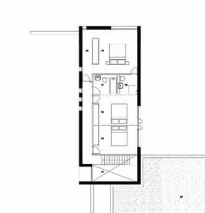
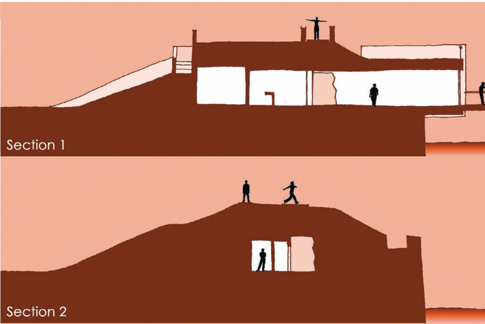
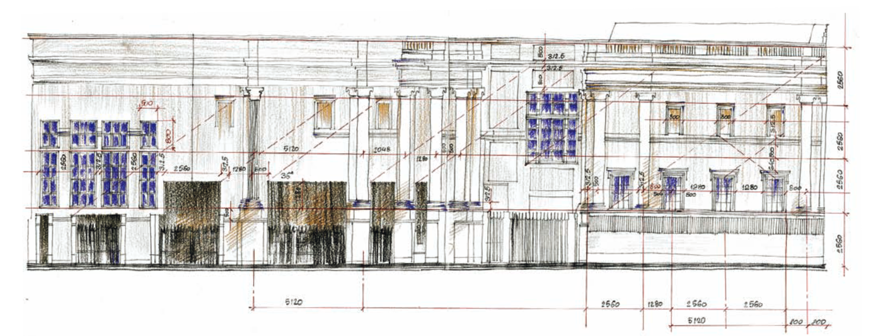
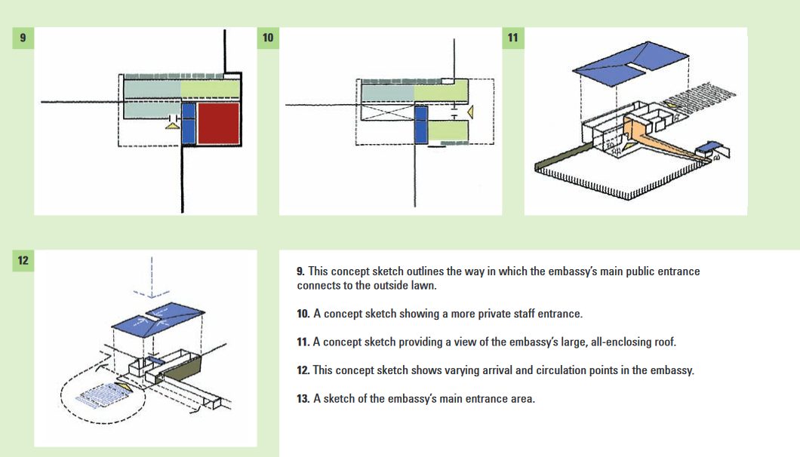
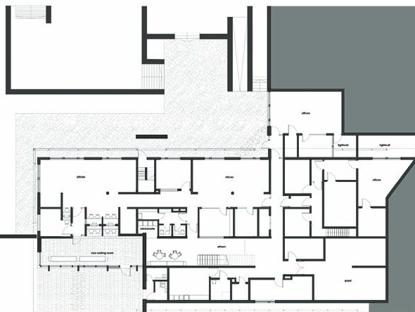
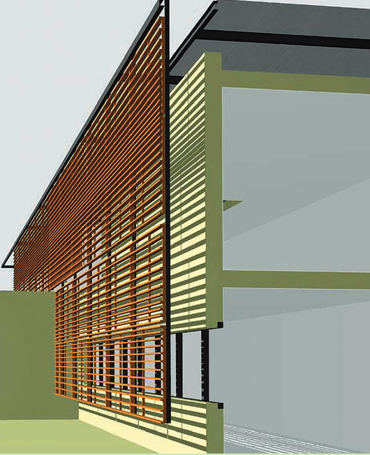

# Architecture Notes
- There are 3 stages/categories of designing
..- Conceptual
..- Developmental
..- Realization

- Idea is the key in sketch phase not accuracy

## Orthographic Projection
### Plan
 A **plan** is an imagined horizontal cross section of a room or building 
1.2 metres above ground or finished floor level.

### Section
- A **section** drawing shows a vertical cross section of a building or space. 

### Elevation
- The **elevation** drawing displayst he building’s outside wrapping; its face or facade

—
### In the ISO paper size system, the height-to-width ratio of all pages is the square root of two (1.4142 : 1). 
that is the golden ratio and fibonacci sequence
—
‘Servant served’ is a description that Louis Kahn used to describe the different categories of space in a building, be it a small-scale house or a large-scale civic building. _Servant spaces have functional use_, such as storage rooms, bathrooms or kitchens – the spaces that are essential for a building to function properly. Served spaces might be living or dining rooms or offices – spaces that the servant areas serve. This concept provides a very useful way to understand the organisation of a building
—
Some Random Knowledge:
**Zeitgeist**:The German term zeitgeist refers to the spirit of a time. In terms of design this is an inevitably changing and shifting notion. The zeitgeist naturally evolves as it responds to current social and cultural phenomena.

## Realization:

 
ii. Sectional Sketch  
iii. Concept Model  
iv. Three-dimensional Sketch  
v. Perspective-rendered Drawing  
vi. Section Drawing  
vii. Perspective Sketch  
viii. Detail Drawing  
xi. The Finished Building  
xii & xiii The Building’s Wrapping  
xiv. Dynamic Surfaces

### Project Concept:

### Site Analysis
decide construction techiques, materials etc understand the place.
### Design Process
show 2D and 3D plans 

### Detail Development

### Finished Building
