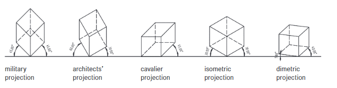

# Basics of Technical Drawing
## Projection Types
### Top View / Roof Plan
### Plan View 
taken at around 1-1.5 m above the floor, include as many apertures(doors, windows etc)
### Elevation (ISO: Views)
### Section 
- created by making a vertical cut, consider a view in parallel projection
- important elements shown in a section include the structure of the  
roof, the floors and ceilings, the foundations, and the walls with their   
apertures.
- The section should also show access to the building via stairs,  
lift, ramp etc
---

—

+ there are different standards for representing kitchen fittings, sanitary, furniture etc. 
